# Protecting-EC2-Instances-With-Guarduty

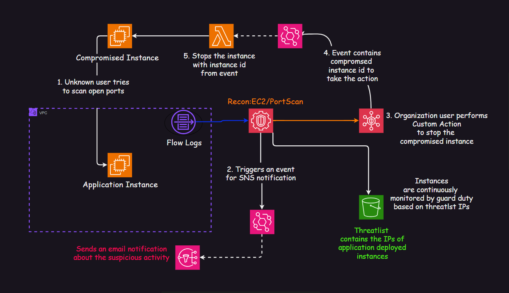

Securing AWS EC2 instances is crucial because attackers often target these instances to exploit their resources. EC2 instances are valuable because they can provide access to sensitive cloud resources like databases, storage, and other instances within the same network. If compromised, an attacker might use the instance’s IAM roles to manipulate critical services like S3 buckets or other infrastructure. Additionally, the instance could be hijacked to join a botnet and participate in DDoS attacks.

In this project, we’ll explore various security measures to prevent such intrusions and protect EC2 instances from being misused, ensuring the integrity and safety of your cloud environment.

# Pre-Requisites
- An AWS account with access on S3, Event-Bridge, Lambda, EC2 Instances, Guard Duty, Security Hub, SNS
- An email account
- Git Bash

# Problem Contexts

The goal of this solution is to protect AWS EC2 instances from external attackers using AWS managed services, such as Amazon GuardDuty. GuardDuty plays a critical role in detecting potential threats based on the IP addresses of EC2 instances. To implement this, a threat list is maintained in an Amazon S3 bucket, containing the IPs of EC2 instances where critical applications are deployed, or services are running that require heightened security.

The URL of the threat list is configured in GuardDuty's threat intelligence, allowing it to monitor incoming traffic and identify any suspicious activity targeting these sensitive instances. When GuardDuty detects anomalous behavior or unauthorized access attempts from external networks, it generates a finding and triggers notifications. These findings are then evaluated to determine the appropriate response based on the nature of the threat, ensuring that the EC2 instances are protected and any potential compromise is swiftly mitigated..

**Aws Guard Duty**: Amazon GuardDuty is a threat detection service offered by AWS that continuously monitors and protects your AWS accounts, workloads, and data. It identifies unauthorized and malicious activity, helping you detect and respond to potential security threats. Generates detailed findings with context, severity levels, and suggested remediation actions. Findings can be integrated with tools like AWS Security Hub, Amazon EventBridge, or third-party security systems for automated response.

Guard Duty monitors:
- CloudTrail Logs: Detects unusual API activity or management console access.
- VPC Flow Logs: Identifies suspicious network traffic patterns.
- DNS Query Logs: Recognizes attempts to connect to malicious domains.

**Security Hub**: AWS Security Hub is a centralized security service that provides a comprehensive view of your security posture across your AWS accounts. It aggregates, organizes, and prioritizes security alerts (findings) from multiple AWS services and supported third-party tools. This enables users to assess and improve their overall security posture more efficiently. Collects and consolidates security findings from AWS services like Amazon GuardDuty, Amazon Inspector, AWS Firewall Manager, and supported third-party solutions. Provides a unified dashboard for easy access and analysis.

Custom actions in AWS Security Hub enable you to define and execute automated workflows or responses to specific findings. These actions can help streamline incident response, enforce compliance, and reduce the time it takes to address security issues. They are particularly useful for integrating Security Hub findings with other AWS services or third-party tools for remediation.

# Proposed Solution

## Step - 1: Lets Create a Lambda Function to act on the EC2 instance

- Open the Functions page of the Lambda console.
- Choose Create function.
- Select Author from scratch.
- In the Basic information pane, for Function name, enter gd-portScan.
- For Runtime, choose Python 3.13.
- Leave architecture set to x86_64, and then choose Create function.
- Keeping every thing as default, create the function
- In the code section, paste the python code from the file *lambda.py*.
- Deploy the code
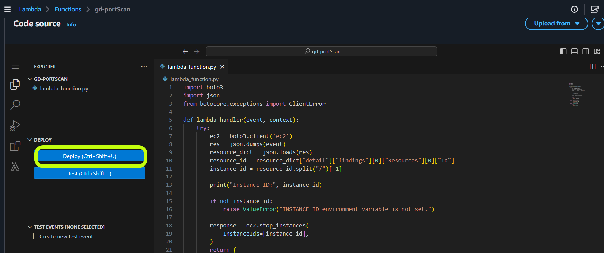
- In the function page, tap on the Configuration
- And in the permission section, tap on the role name
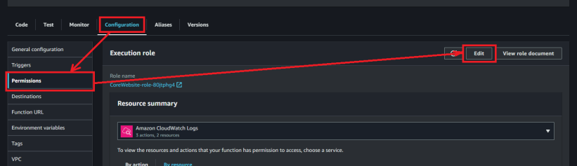
- Tap *Add permissions*, search for *AmazonEC2FullAccess* (this will give permission to the lambda function to act on ec2 instance)
- And confirm it
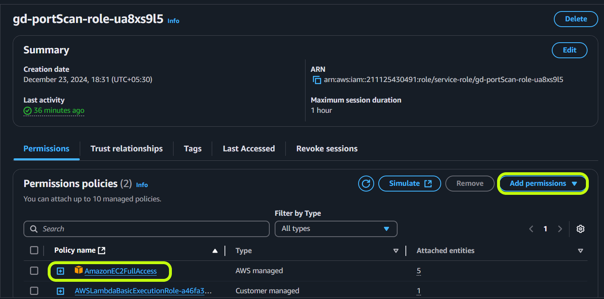

## Step - 2: Lets Create a SNS topic and subscribe it

- Go to the SNS console
- Give a name such as *gduty-eb-trigger*
- Create a SNS topic
- Tap on the topic name
- Create subscription
- Select the topic arn and protocol as Email
- And give any email address
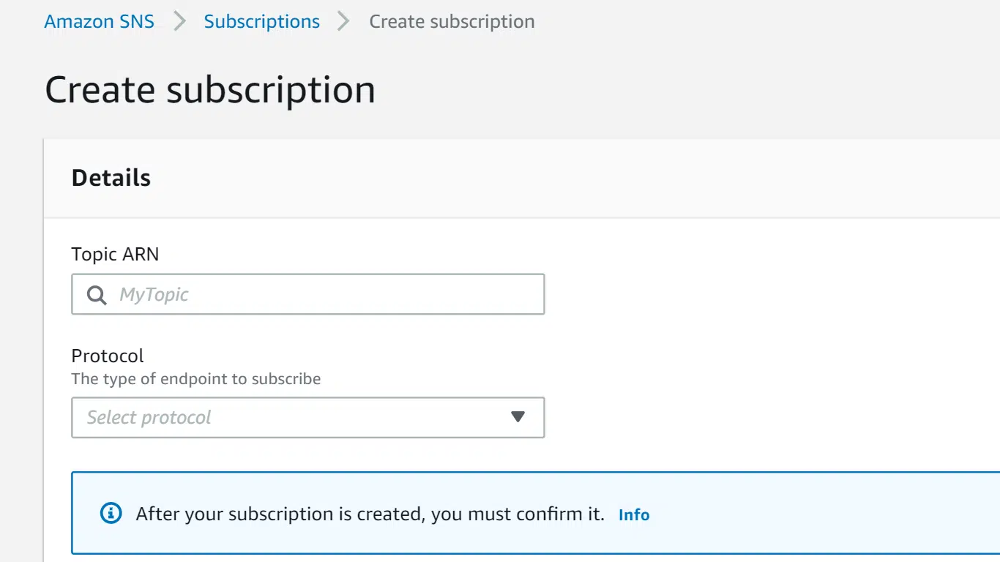

## Step - 3: Enable Security Hub to Create a Custom Action for Remediation

- Open the AWS Security Hub console at https://console.aws.amazon.com/securityhub/.
- In the navigation pane, choose Settings and then choose Custom actions.
- Choose Create custom action.
- Provide a Name, Description, and Custom action ID for the action.
- The Name must be fewer than 20 characters.
- Give a name as *Gduty-Stop-Instance*
- The Custom action ID must be unique for each AWS account(give any set of numbers or letters).
- Choose Create custom action.
- Make a note of the *Custom action ARN*. You need to use the ARN when you create a rule to associate with this action in EventBridge.

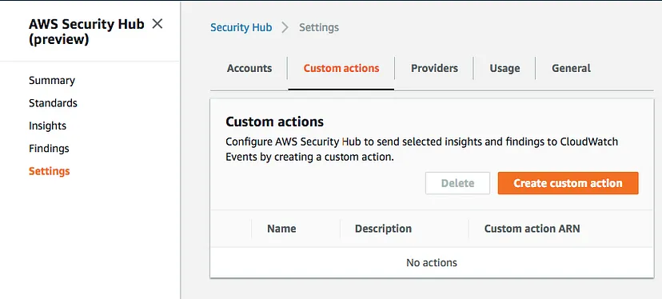


## Step - 4: Lets Create Event Bridge Rules

**Create a rule for lambda function**

- Go to the EventBridge console.
- Underneath Events, select Rules.
- Select Create Rule.
- Provide a name *trigger-lambda-fn*
- Select *Rule with event pattern*

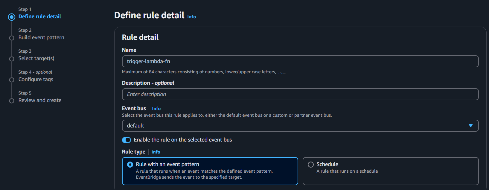

- After previous page, paste the below event pattern
```
{
    "source": ["aws.securityhub"],
    "detail-type": ["Security Hub Findings - Custom Action"],
    "resources": [""] --> paste the custom arn in from step 3
}
```
- Now in the next page choose, Select target as Lambda
- And choose the function that you have created
- Keeping every thing as default create the rule

**Create a rule for SNS Topic**

- Follow the above process
- Give a name as *triggerby-sns-topic*
- Provide the below event pattern
```
{
    "source": ["aws.guardduty"],
    "detail": {
      "type": ["Recon:EC2/Portscan"]
    }
}
```
- Choose the target as SNS topic
- choose the topic that you created
- Keeping every thing as default create the rule

## Step - 4: Create Two EC2 instances in Different VPCs

- Create A VPC with cidr 10.0.0.0/16
- a subnet for the VPC with cidr 10.0.0.0/24
- attach an internet gateway to the VPC
- create a route table
- in the subnet association, associate the subnet to the present route table
- in the route, create a new route with above internet gateway with destination 0.0.0.0
- create an ec2 instance with name *functional*, with the present subnet and having a security key
- enable public ip association
- in the security group, associate ssh, sql ports
- create the instance
- copy or note the ip of the *functional* instance

Create another ec2 instance with default VPC name *compromised-01*, a security key downloaded to access with ssh, turn on ssh port for My Ip, enable public ip.

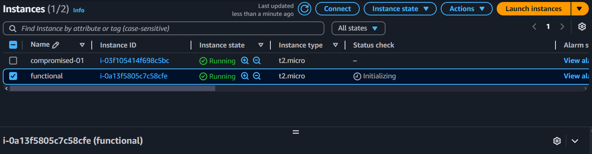

## Step - 5: Create a S3 bucket to store the Threatlist

- Create a S3 bucket
- Select **General purpose**

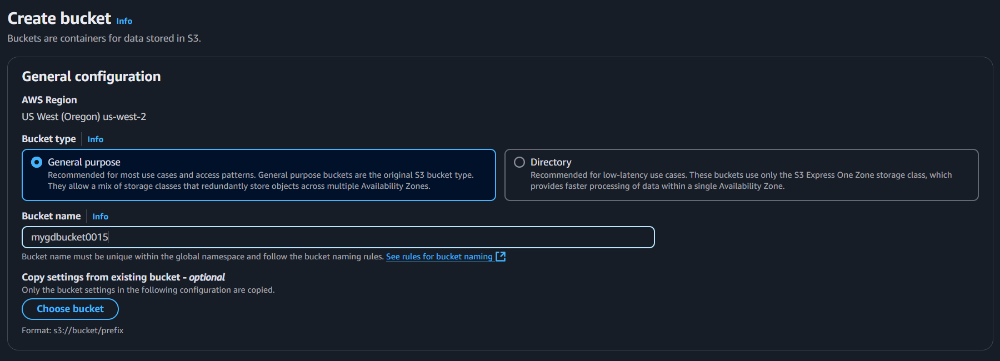

- Tap onto the bucketname and move to **Edit bucket policy** >> Edit
- And paste the below policy

```
{
    "Version": "2012-10-17",
    "Statement": [
        {
            "Sid": "Statement1",
            "Principal": "*",
            "Effect": "Allow",
            "Action": [
                "s3:*"
            ],
            "Resource": [
                "arn:aws:s3:::mygdbucket0015/*"
            ]
        }
    ]
}
```
- create a file with name *threatlist.txt* and paste the ip of *functional* named instance into the file
- now in the bucket that you have created, tap on upload >> Add file, add the *threatlist.txt* >> Upload
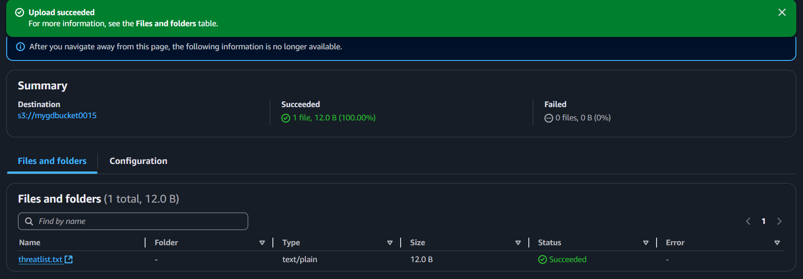
- next note the url of the object, tap on the object >> note the url
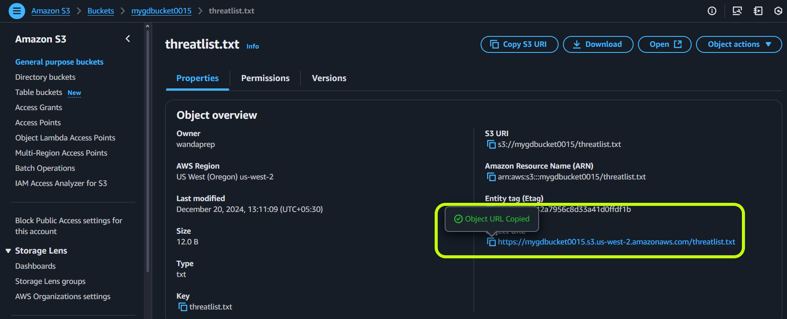


## Step - 6: Enable Guard Duty for *findings* 

- In the search bar, search for Guard Duty
- Enable and give the required details
- In the dashboard of the Guard Duty, below the section you will find *Settings* -> *Lists*, tap on the list
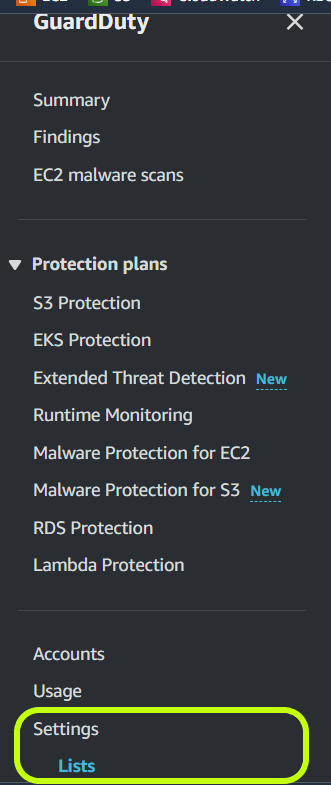

- Tap on *Add a threat IP list*, to initiate observation of the instance
- Give a name as threatlist
- Give the s3 object url
- Format as *Plaintext*
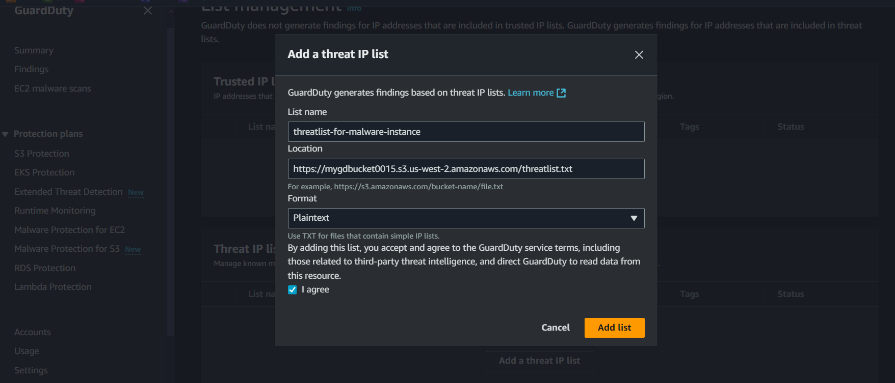
- Now tap on action to Activate the list
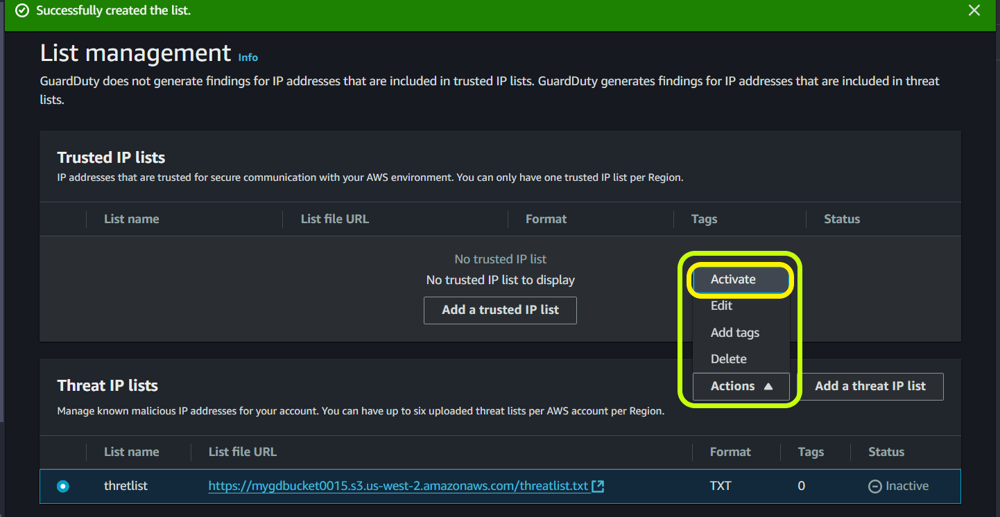

We have successfully added the threatlist for the instance ip.

## Step - 7: Lets have some actions

- Login to the Compromised ec2 instance
- Open Downloads folder or the folder where you have downloaded the private key of the instance
- There open the git Bash
- Move to the ec2 dashboard and select the compromised instance, and above the bar tap on connect, to get the ssh command to login to the ec2 instance
- copy the command >> paste in the git bash >> and tap enter
- update the package manager by - sudo yum update -y 
- update user to root user by - sudo su
- install nmap tool by - yum install nmap -y
- open a text editor by - vi gd-script.sh >> type to insert text - i
- paste the bash code from the repo
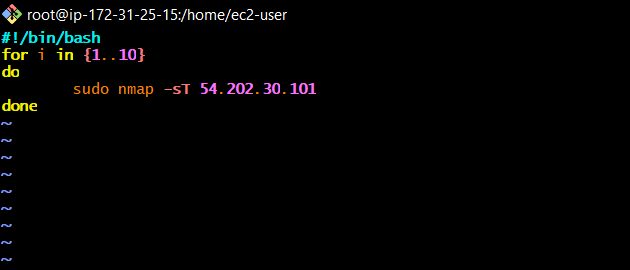
- tap on - escape key >> wq >> enter key
- give execution permission to the script as - chmod +x *gd-script.sh*
- run the script with >> ./gd-script.sh >> enter key

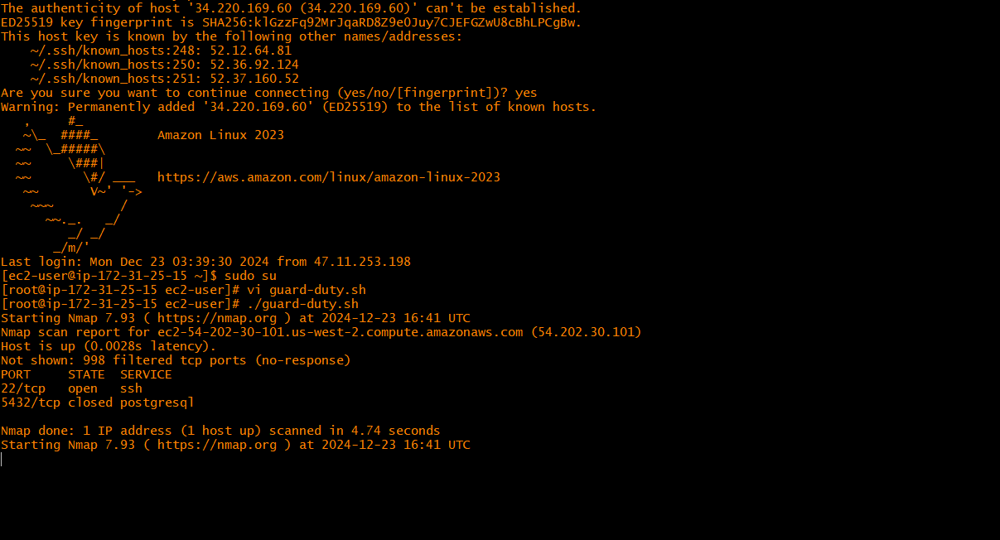

# Observation

Now with the execution of the last step we are performing a task to identify which ports are open for the functional instance, this types of actions are performed by people from outside the organisation who want to identify potential vulnerablities. Port scanning is a technique used to detect which ports are open, what services are running, and discover misconfigured systems. And gaining unauthorized access the misconfigured services to perform some brute-force attacks like hosting malware or launching further attacks.

Go to guard duty console, after 5-6 minutes in the *findings* section you will observe certain logs of port scanning by the compromised instance. In the email inbox of the subscribed user, there will be a notification on this behaviour from SNS. 
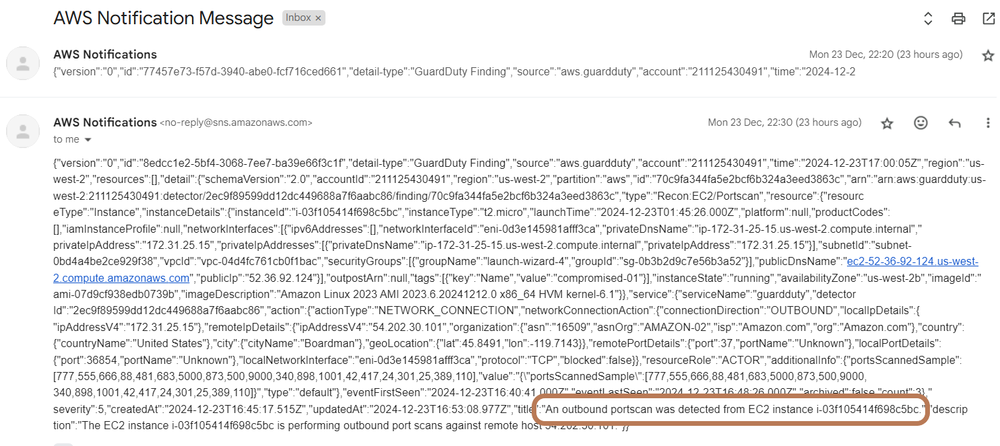
To perform the lambda action to stop the compromised instance, go to the *Security Hub*, you will discover the same finding of the guard duty. Select the finding, up the bar there is an *Actions* button. Tap on the lambda action to perform.
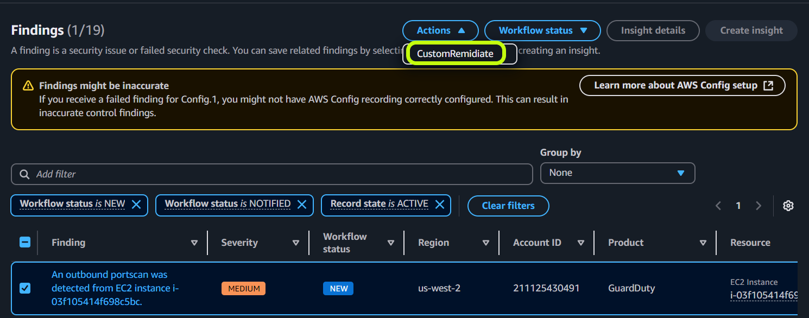
The event bridge will send an event to lambda function and the compromised instance will be stopped.
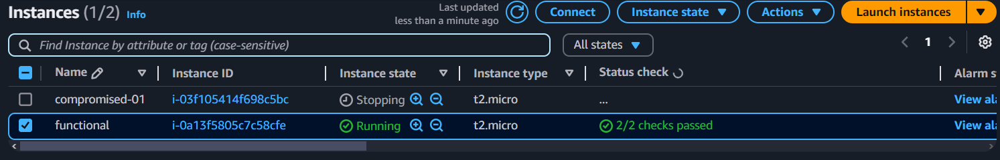

